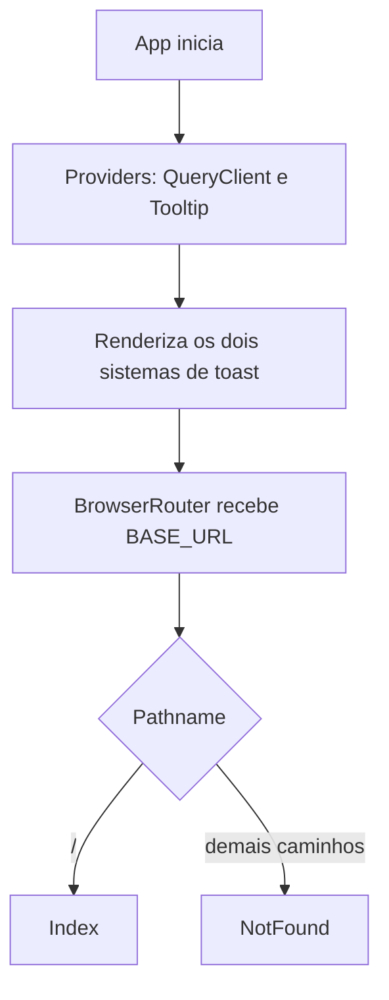

# Fluxo por função — `App`

```mermaid
flowchart TD
    A[App inicia] --> B[Providers: QueryClient e Tooltip]
    B --> C[Renderiza os dois sistemas de toast]
    C --> D[BrowserRouter recebe BASE_URL]
    D --> E{Pathname}
    E -->|/| F[Index]
    E -->|demais caminhos| G[NotFound]
```

Não há carregamento assíncrono, autenticação ou recuperação de erro no roteamento observado.

**Confiança:** 🟢 CONFIRMADO — `src/App.tsx`.
